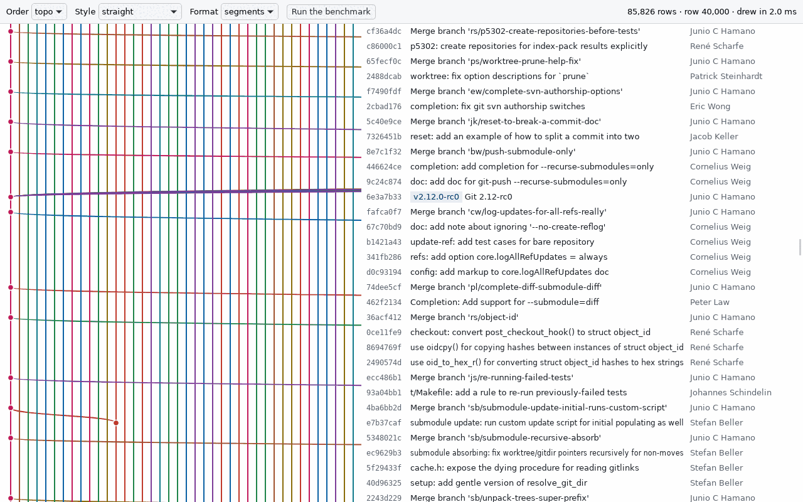
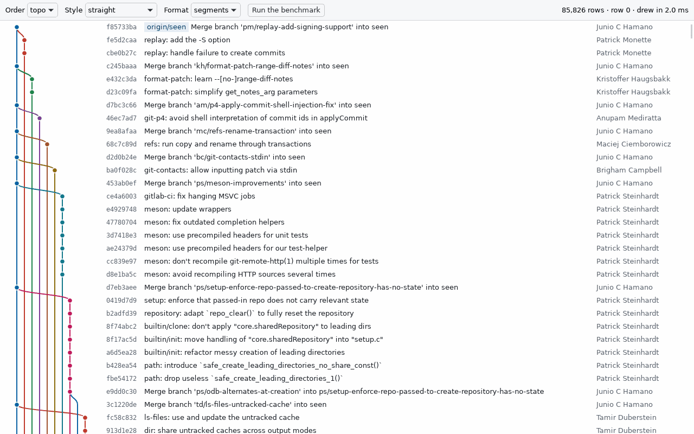
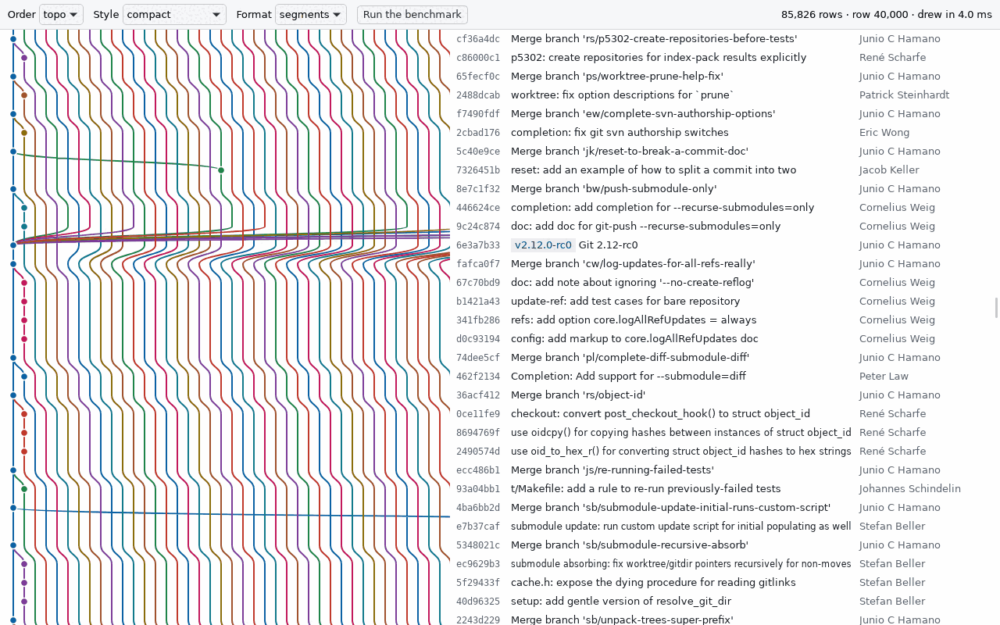
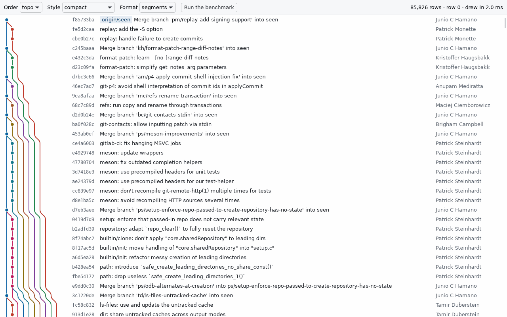
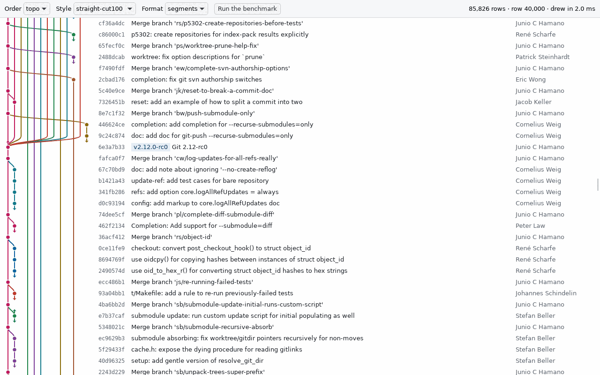
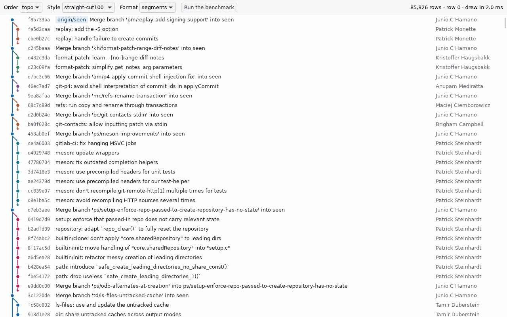
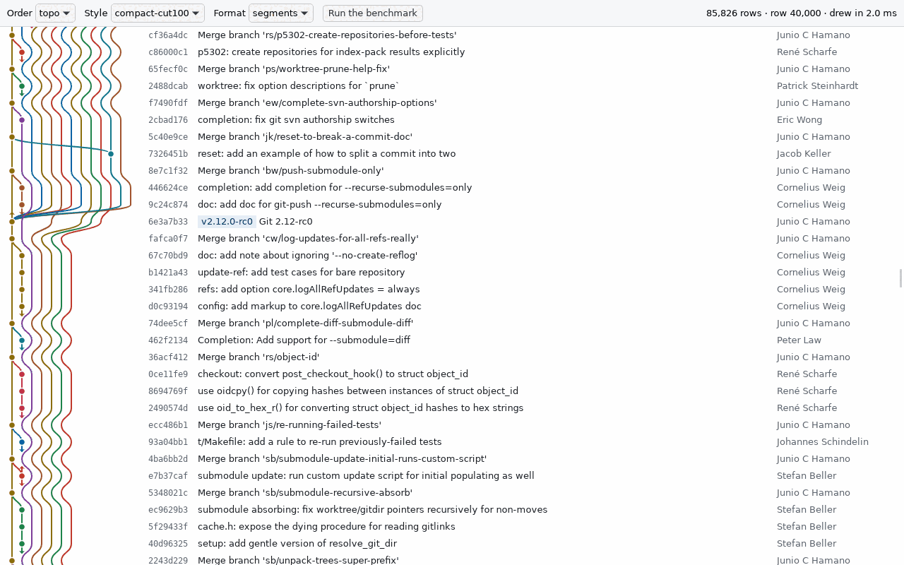
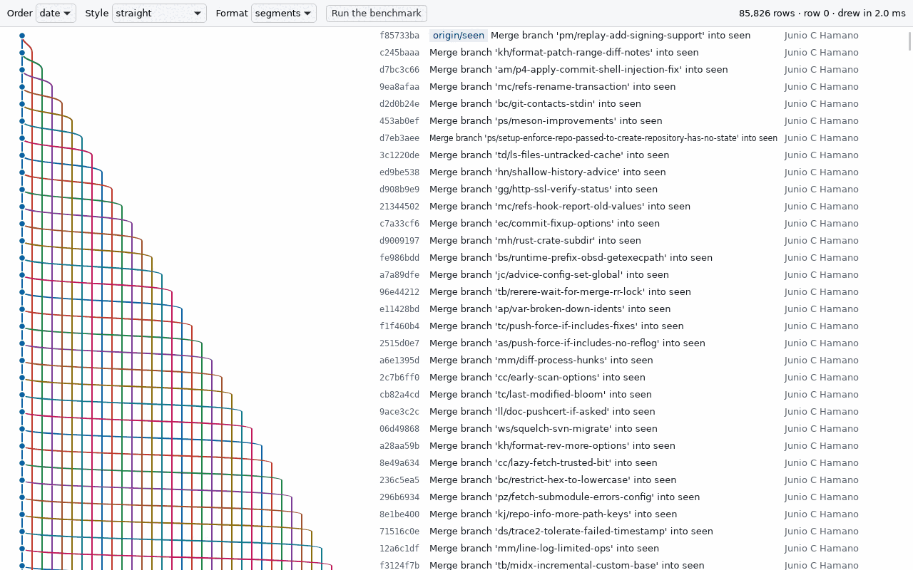
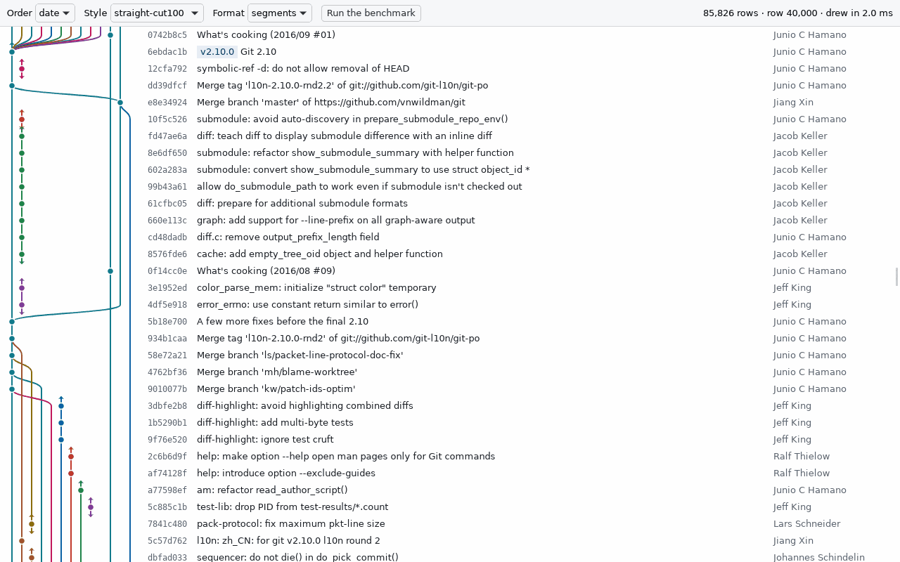

# The commit graph: straight lanes with long edges cut, drawn from index-addressed windows of segments

The Commit graph Widget shows history in topological order. Its lanes are straight: a lane never moves once it starts, and HEAD's first-parent line is pinned to column 0. An edge longer than 100 rows is cut: it is drawn as a short arrow at each end, as gitk does, rather than as a line down the whole screen. Rust loads the graph with `gix`, using the repository's commit-graph file, and lays out the whole history when the repository opens. The UI draws one canvas the size of the viewport. It fills it from 200-row windows it asks for by row index, not by keyset cursor. Each window carries its rows and the line segments that reach it, and the segments keep their ids across windows.

This comes from the timeboxed spike in issue #7, measured on `git/git`. Its throwaway code and raw results are in [`spikes/graph/`](../../spikes/graph/README.md). The `graph` crate (M2) is written fresh from this ADR.

## What was measured

- **Repository.** A fresh clone of `git/git`: 85,826 commits across all refs (82,327 from HEAD), 21,682 of them merges, and 1,009 commits with a branch or tag label.
- **Machine.** The Linux sandbox: 16 cores, gix 0.88.0, git 2.47.3, Tauri 2.12.0 with WebKitGTK 2.52.6 under Xvfb. There's no GPU, so WebKit paints in software.
- **Screen.** A 1280×800 screen, giving a 1280×762 viewport, with 24-pixel rows: 33 rows a screen.
- **Timings.** The layout timings are the median of five warm runs. The frame times come from the spike's canvas scrolling itself in `requestAnimationFrame`.

### Loading, ordering and layout

| Step | With a commit-graph file | Without one |
| --- | ---: | ---: |
| Load the graph (ids, times, parents) | 58 ms | 993 ms |
| Order it, topological | 1.5 ms | 1.5 ms |
| Lay out the first 40 rows | 0.1 ms | 0.1 ms |
| Lay out the whole history, straight with cuts at 100 | 15 ms | 15 ms |
| Read the summaries and authors for a 200-row window | 1.4 ms | 1.4 ms |
| Open in the canvas: load, order and lay out the whole history | 86 ms | 1,035 ms |
| First screen drawn, from the webview's navigation | 168 ms | 1,120 ms |

The PRD's target, a first screen in under 2 seconds, holds either way. Almost all of the time goes to loading the graph without a commit-graph file. A fresh clone has none, and `git commit-graph write --reachable` wrote one in 0.8 s. Ordering and laying out are cheap enough that it isn't worth streaming a first screen ahead of the whole layout. Details: [`bench-with-commit-graph.md`](../../spikes/graph/results/bench-with-commit-graph.md), [`bench-without-commit-graph.md`](../../spikes/graph/results/bench-without-commit-graph.md).

### Lane assignment

Two approaches were compared, each with and without cutting long edges:

- **Straight** lanes never move. HEAD's first-parent line is column 0. A new branch takes the leftmost free column, and a merge's second parent takes the first free column to its right.
- **Compact** lanes close up whenever one ends, as `git log --graph` does, so every lane to the right shifts left.

| Topological order | Widest row, lanes | Mean width | 95th percentile | Whole-history layout | Line segments | Lane moves | Layout in memory, as segments |
| --- | ---: | ---: | ---: | ---: | ---: | ---: | ---: |
| Straight | 280 | 194.2 | 268 | 159 ms | 107,558 | 0 | 3.1 MiB |
| Compact | 280 | 116.3 | 206 | 239 ms | 1,988,886 | 1,883,682 | 46.2 MiB |
| Straight, cut at 50 rows | 17 | 3.0 | 7 | 15 ms | 89,815 | 0 | 2.8 MiB |
| **Straight, cut at 100 rows** | **27** | **5.8** | **14** | **15 ms** | **92,282** | **0** | **2.8 MiB** |
| Straight, cut at 500 rows | 98 | 48.2 | 84 | 75 ms | 103,147 | 0 | 3.0 MiB |
| Compact, cut at 100 rows | 27 | 4.8 | 12 | 17 ms | 167,928 | 76,765 | 4.6 MiB |

On `git/git` the real problem is width, and neither approach solves it on its own. Topic branches fork from an old `master` and are merged far below, so hundreds of lanes are open at once and a row's own commit can sit 200 columns to the right, off screen. Compact makes rows narrower on average. It does so by moving almost every lane on almost every merge, which gives the rippling lines in the screenshot and 18 times as many segments to send. Cutting long edges is what makes the graph readable. At 100 rows it leaves 15,276 stubs, 18% of commits, and a mean width under 6 lanes. With cuts, compact is slightly narrower than straight, but it moves lanes 76,765 times and loses HEAD's line from column 0 on 1.8% of rows. Straight lines are easier to follow.

| | Row 40,000 | Row 0 |
| --- | --- | --- |
| Straight |  |  |
| Compact |  |  |
| **Straight, cut at 100 (chosen)** |  |  |
| Compact, cut at 100 |  | |

### Order

In date order, a topic's commits are scattered among everyone else's by commit time, so they land far from their merge. Straight lanes with cuts at 100 are then 14.4 lanes wide on average instead of 5.8, with 20,679 stubs. The first screen is 38 lanes wide instead of 15 without cuts, because the newest merges each open a lane to a topic far below. Topological order (git's `--topo-order`) keeps each topic directly under its merge.

| Date, straight, row 0 | Date, straight cut at 100, row 40,000 |
| --- | --- |
|  |  |

### Frame times while scrolling (Linux, WebKitGTK)

Each scenario scrolls the canvas by script, a fixed distance every animation frame, and measures the interval between frames:

- **Steady:** 5 rows a frame, over 600 frames.
- **Fast:** 25 rows a frame, over 600 frames.
- **Fling:** 100 rows, or 2,400 pixels, a frame, over 300 frames.
- **Jumps:** to a random row every 10th frame, as dragging the scrollbar does, over 300 frames.

WebKitGTK rounds `performance.now()` to a millisecond, so a frame counts as dropped only when it is more than 25 ms after the last. With nothing drawn, frames arrive every 16–17 ms. Full results are in [`results/canvas.md`](../../spikes/graph/results/canvas.md).

| Topological order, 1× scale | Frame interval p50 / p99 / max | Dropped frames | Draw p50 / max | Frames with rows not loaded yet | Mean window size |
| --- | ---: | ---: | ---: | ---: | ---: |
| **Straight, cut at 100, segments**: steady | 17 / 19 / 26 ms | 1 of 599 | 1 / 3 ms | 0 | 30 KiB |
| fast | 17 / 20 / 35 ms | 2 of 599 | 2 / 6 ms | 0 | 34 KiB |
| fling | 17 / 20 / 22 ms | 0 of 299 | 2 / 3 ms | 0 | 34 KiB |
| jumps | 17 / 24 / 27 ms | 2 of 299 | 2 / 3 ms | 29, one for each jump | 35 KiB |
| Straight uncut, segments: fling | 17 / 20 / 21 ms | 0 of 299 | 2 / 6 ms | 0 | 38 KiB |
| Straight uncut, bands: fling | 19 / 31 / 35 ms | 16 of 299 | 2 / 5 ms | 0 | 283 KiB |
| Compact uncut, segments: fling | 20 / 30 / 34 ms | 17 of 299 | 3 / 6 ms | 0 | 166 KiB |
| Compact uncut, bands: fling | 22 / 33 / 40 ms | 52 of 299 | 3 / 4 ms | 0 | 280 KiB |

With cuts, scrolling holds 60 fps in every scenario, and a fling never shows a row that hasn't loaded. After a jump, at most one frame shows placeholder rows, and the next frame fills them (a window arrives in 4 ms at the median). Drawing is never what makes a frame late: it takes 1–3 ms at the median whatever the layout. Frames drop when large windows arrive, most likely because the webview decodes each window's JSON on its main thread. That is what rules out both sending per-row edges ("bands") and leaving edges uncut for compact lanes.

At 2× scale (`GDK_SCALE=2` on a 2560×1600 Xvfb screen), the chosen layout fell to about 43 fps (a frame every 23 ms at the median). Windows took 120–170 ms to arrive, and a fling showed unloaded rows in 246 of 299 frames. Software painting of four times the pixels starves WebKit's main thread, and IPC replies queue behind it. A real HiDPI screen composites on the GPU, so this is not evidence either way, and it's the first thing to check by hand.

## Decisions for M2

- **Loading.** The `graph` crate loads ids, commit times and parents for all refs with `gix`'s revision walk, using the commit-graph file. When a repository has no commit-graph file, Lanewise writes one in the background with the `git` CLI runner (`git commit-graph write --reachable`), as `git gc` does by default. The first open is slow (about 1 s on `git/git`) and later ones are fast.
- **Order and lanes.** Topological order, newest first, over all refs. Straight lanes, with HEAD's first-parent line pinned to column 0 and never cut, and edges longer than 100 rows cut to stubs. The cut length is a setting; 50 and 100 both read well.
- **Layout.** Rust lays out the whole history when the repository opens and whenever its refs change, and keeps it as segments: a run of one lane, with the curve into it and out of it. They sit in a 256-row block index for window queries, taking 2.8 MiB for `git/git`. Summaries, authors and labels are not kept; they are read per window with `gix`.
- **The IPC window.** One command, `graphWindow { repository, layout, start, count }`, returns `{ layout, total, start, rows, segments }`:
  - **`rows`.** Each row has its id, summary, author, time, node column, colour, labels, and the rows its cut edges lead to, down and up.
  - **`segments`.** Every segment that reaches the window, as flat numbers `id, start, length, from, column, to, colour`. The UI keeps a segment it has seen by its id and draws a long line once, not once per row.
  - **`layout`.** A token for the layout the window was read from. When the refs change, Rust lays out again under a new token. A request with an old token gets a `staleLayout` error, and the UI drops its windows and asks again.
  - **Index addressing.** Windows are addressed by row index, not by the keyset cursor `commands/src/page.rs` gives other lists. Dragging the scrollbar needs row 40,000 without reading the rows before it, and within one layout an index is as stable as a cursor. `count` keeps the command API's default of 200 and limit of 1,000.
- **Drawing.** The drawing follows the spike:
  - The canvas is the size of the viewport and stays on screen (`position: sticky`). A spacer under it gives the scrollbar the whole history's height.
  - Each animation frame after a scroll draws only the rows on screen, from the windows it has. Lines are batched into one `Path2D` per colour, and rows not loaded yet are drawn as placeholders.
  - The UI keeps the window on screen plus one either side, and forgets windows more than six away.
  - The graph takes only as many columns as the rows on screen need, up to 45% of the width.

## Consequences

- A cut edge hides where it goes. The arrow says only that the parent, or child, is far away. TODO(M2): the stub names its other end and takes you there by click and by keyboard, and the Commit details Widget lists every parent and child.
- The canvas is invisible to assistive technology. It is paired with the accessible commit grid (`role="grid"`) the PRD requires, which is fed from the same windows and says each row's place in the graph in words. Arrow keys move through commits, and the canvas follows the grid's selection.
- The spike's palette is for its light background only. The Theme's lane colours, `--lane-0` to `--lane-7`, meet 3:1 non-text contrast in both themes and stay apart from each other, which `contrast.test.ts` checks. The graph scrolls to a commit without animating, so it has no motion to reduce.
- Frame times from Xvfb are only a floor on how well this runs. The sandbox paints in software, the scrolling is scripted rather than real wheel or trackpad input, and timers are rounded to a millisecond.

## Measured in the Desktop App

Issue #16 measured the built Desktop App against PRD §11's targets with [`bench/`](../../bench/README.md). It opens a `git/git` clone from the Welcome screen over WebDriver and times every frame. CI runs it on Linux and fails if the first screen or layout misses its target.

The run: 85,838 rows, no commit-graph file, WebKitGTK 2.52.6 under Xvfb at 1280×800, 16 CPUs, on a shared host with a load average of 3–8.

| Target | Measured |
| --- | --- |
| First screen in under 2 s | 1109–1167 ms over the launches of the final runs. The first `graphWindow`, which reads and lays out the history, takes 1039–1104 ms of it |
| Layout never blocks the UI thread | The longest frame while the history is read and laid out is 17–19 ms, with none over 50 ms. Opening the Tab's first paint takes 48–56 ms whatever the history's size |
| Scrolling holds 60 fps: a wheel, 3 rows a frame | 59.8 fps, 4 of 600 frames dropped |
| Scrolling holds 60 fps: a fling, 40 rows a frame | 59.8 fps, 6 of 600 dropped |
| Scrolling holds 60 fps: scrollbar jumps | 59.2 fps, 3 of 600 dropped. 51 frames showed a row "Reading…" for a frame or two after a jump |
| Scrolling holds 60 fps: the whole history, 60 rows a frame | 58.1–59.8 fps. 0.7–1.9% of 1,431 frames dropped from run to run, and once 2.9% on a heavily loaded host, against a target of 1% |
| Memory stays bounded | Peak 883 MiB. Scrolling the whole history takes it from 755 MiB to at most 883 MiB, and the second time to at most 823 MiB, so it stays flat |

Before the issue, the Commit graph drew a scroll's rows a frame after the frame that scrolled. React renders a scroll's state update after the browser paints. So every frame of a fast scroll showed rows with nothing drawn: 600 of 600 in a fling. The fixes:

- **Rows and lanes in the frame that scrolls.** The history renders a scroll synchronously (`flushSync`), and the canvas paints in a layout effect, so the rows and lanes are ready before the browser paints the scroll.
- **Less work in each frame.** The viewport and each row set `contain: strict`, so a row being replaced doesn't lay out the page around it. Row components are memoised with stable callbacks, so rows still on screen don't render again. This took a 40-row frame from 10–11 ms to 8–9 ms at the median.

The whole-history scroll is the one that lands on either side of its target, and which way depends on the host's load. Its dropped frames are scattered, and most are a single vsync missed (26–34 ms). About 6 in each pass come as a window arrives, which matches the spike's finding that the webview decodes each window's JSON on the main thread. It moves 3,600 rows a second for 24 seconds, far faster than a user scrolls. If a real screen shows it dropping frames, the next step is to decode windows off the main thread.

## Still to check by hand on macOS (WKWebView) and Windows (WebView2)

Build the Desktop App on each and run [`bench/`](../../bench/README.md) against a `git/git` clone. On macOS, measure by hand as the README describes, since `tauri-driver` has no WebDriver for WKWebView. Paste the results here.

- **Frame times at 1× and on a HiDPI screen.** A Retina display on macOS; 150% and 200% scaling on Windows. This matters most, since 2× could not be judged under Xvfb.
- **Trackpad and wheel scrolling.** Momentum scrolling on a macOS trackpad, and a notched wheel and precision touchpad on Windows. Rows must never show as placeholders during a fling, and lines must stay smooth.
- **Scrollbar drags.** Dragging the scrollbar across the whole history should show at most a frame of placeholders at each stop.
- **IPC latency.** How long a 200-row window of about 35 KiB takes to arrive over each webview's IPC.
- **Crispness at 2×.** Text and lines should be sharp on a 2× canvas, since the canvas is sized in device pixels.
- **First screen.** How long the first screen takes, with and without a commit-graph file. On Windows, try it with Defender scanning the clone.
